# DarkStop — Confidential Stop-Loss Orders on Flare

Stop-loss orders whose trigger prices never touch the chain. Built for the
Flare Summer Signal hackathon (DoraHacks), Bounty 2 — Confidential Compute
Apps.

## The problem

On-chain stop-loss orders leak the one thing they must protect: the trigger
price. Whether it sits in public contract storage or in a keeper's mempool,
anyone can read every trader's liquidation level, push the price to the
trigger, and absorb the forced sell. Centralized exchanges hide your stops;
DeFi today cannot.

## The solution

DarkStop keeps the trigger price ECIES-encrypted end-to-end: encrypted in the
browser to the TEE extension's enclave key, opaque in the on-chain calldata,
decrypted and monitored only inside the TEE (Flare Confidential Compute). The
chain learns the trigger only at settlement. Even then, the contract does
not trust the TEE alone: `settle()` re-reads the live FTSO FLR/USD feed and
requires a fresh price at-or-below the revealed trigger before paying out.

## Architecture

```mermaid
flowchart LR
    subgraph Browser
        A[Order form<br/>trigger price] --> B[ECIES encrypt<br/>go-ethereum wire format]
    end
    subgraph Coston2
        C[DarkStopVault<br/>placeOrder&#40;ciphertext&#41; + deposit]
        G[settle&#40;&#41;<br/>FTSO re-check on-chain]
        H[FtsoV2<br/>FLR/USD feed]
    end
    subgraph TEE[TEE extension &#40;Go&#41;]
        D[PLACE_ORDER handler<br/>decrypt + validate]
        E[In-enclave order store]
        F[FTSO watcher<br/>poll price, detect trigger]
    end
    B -->|ciphertext only| C
    C -->|FCC instruction| D
    D --> E
    E --> F
    F -->|price &le; trigger:<br/>submit settle tx| G
    H -->|getFeedById| G
    H -->|price feed| F
    G -->|USDT0 payout| I[Order owner]
```



Data flow: the browser encrypts `{triggerPrice}` to the enclave public key and
calls `placeOrder(ciphertext)` with a native-token deposit. The vault forwards
the ciphertext through the FCC instruction flow (`sendInstructions`, OPType
`DARKSTOP` / OPCommand `PLACE_ORDER`). The TEE extension decrypts, stores the
order in enclave memory, and polls the FTSO FLR/USD feed. When the price
crosses the trigger, it submits `settle(orderId, trigger, maxAge)`; the
contract independently re-verifies the price against FTSO and pays the owner
in USDT0. Explorer calldata for `placeOrder` shows only an opaque blob.

## What was built during the hackathon

Everything in this repository is new work built during the hackathon, on top
of the official [`flare-foundation/fce-extension-scaffold`](https://github.com/flare-foundation/fce-extension-scaffold)
(the Hello World FCC extension template, credited throughout). Specifically:

- **`contracts/DarkStopVault.sol`** — deposit vault + FCC instruction sender.
  `placeOrder(bytes ciphertext)` stores the deposit and forwards the encrypted
  blob (no price data on chain), `settle()` verifies the TEE executor and
  re-checks the live FTSO price with a contract-capped 300-second staleness
  window, `cancel()` refunds.
  Plus `MockUSDT0.sol` as the testnet payout token.
- **Go TEE extension** — `PLACE_ORDER` / `CANCEL_ORDER` handlers, ECIES
  decryption (go-ethereum `crypto/ecies`), an in-enclave order store, and an
  FTSO watcher goroutine that polls FLR/USD, detects trigger crossings, and
  submits settlement transactions with retry/backoff and per-attempt audit
  logging.
- **Frontend (Next.js)** — wallet connect, order form, and a from-scratch
  browser ECIES encryptor (`frontend/lib/ecies.ts`) wire-compatible with
  go-ethereum's `crypto/ecies` (eciesjs is not — verified and documented).
  JS-encrypt → Go-decrypt interop is proven by a conformance suite against a
  Go-produced test vector. Live order table flips Pending → Executed from
  chain events.
- **Tooling** — Coston2 deployment pipeline, a one-command local proof
  (`scripts/demo-e2e.sh`) that exercises the real Go decrypt/store/watcher
  path, fork tests against the real Coston2 FTSO, and a bring-up runbook for
  the Coston2 TEE proxy.

## Flare integration

**FCC (Flare Confidential Compute) — full lifecycle.** The vault is a real
FCC instruction sender: extension registered on `TeeExtensionRegistry`
(extension id 503), instruction fee paid through `sendInstructions`, OPType /
OPCommand constants mirrored byte-for-byte across Solidity, Go config, and
decoder registration, and the TEE machine registered on-chain. The product is
impossible as a plain smart contract. The confidentiality comes from the TEE.

**FTSO — used in two places.**

1. *Inside the TEE*: the watcher polls the block-latency FLR/USD feed to
   detect trigger crossings privately.
2. *On-chain at settlement*: `settle()` calls
   `FtsoV2.getFeedById(FLR_USD)` itself and requires the price to be fresh
   and at-or-below the revealed trigger. The executor may request a stricter
   window, but the contract caps it at 300 seconds. The contract never trusts
   the TEE's price report alone.

```solidity
(uint256 value, int8 decimals, uint64 timestamp) = FTSO_V2.getFeedById(FLR_USD);
require(_maxAgeSec <= MAX_PRICE_AGE_SEC, "max age too large");
require(block.timestamp - timestamp <= _maxAgeSec, "stale price");
require(price <= _triggerPrice, "price above trigger");
```

## Live deployment (Coston2, chain id 114)

| Item | Address |
|---|---|
| DarkStopVault | [`0xd93E8F7dE2A5A7C4eC45F115f7047103da2dD8bF`](https://coston2-explorer.flare.network/address/0xd93E8F7dE2A5A7C4eC45F115f7047103da2dD8bF) |
| MockUSDT0 (payout token, 6 decimals) | [`0x6196b20FaeCE88ace220297122bB170A5B97b60F`](https://coston2-explorer.flare.network/address/0x6196b20FaeCE88ace220297122bB170A5B97b60F) |
| FtsoV2 (resolved via FlareContractRegistry) | `0xC4e9c78EA53db782E28f28Fdf80BaF59336B304d` |
| Extension ID (TeeExtensionRegistry) | 503 (`0x…01f7`) |

Full address list, tx hashes, and on-chain smoke-test transcript:
[`docs/deployments.md`](docs/deployments.md).

## Trust model and current limitations

Stated plainly, because judges should not have to dig for this:

- **The TEE runs in simulated mode** (`SIMULATED_TEE=true`), the mode the
  official scaffold supports for Coston2 development. Flare confirmed in the
  hackathon Telegram that the Coston2 simulated approach is accepted for
  judging. In simulated mode the confidentiality guarantee is architectural,
  not attested — the roadmap item is a real attested TEE on Songbird once the
  FCC rollout completes.
- **The Coston2 `placeOrder` path is gated on Flare-side infrastructure.**
  Our TEE machine is registered on-chain and our proxy is provably healthy
  (Flare's FTDC proxy pulls its `TEE_INFO` every ~10s), but the FTDC proxy has
  not produced the availability-check attestation for our instruction, so
  `getRandomTeeIds` reverts and `placeOrder` cannot complete on the live
  testnet. This is documented, escalated to the Flare team, and outside our
  code. The end-to-end flow is therefore demonstrated two ways: the full
  place → trigger → settle loop on a local dev stack, and the settlement path
  against the *real* Coston2 FTSO via fork tests
  ([`docs/coston2-runbook.md`](docs/coston2-runbook.md) has the full account).
- The trigger price is revealed at settlement. That is the product's contract:
  pre-execution secrecy is what prevents stop hunting; post-execution reveal
  is inherent to on-chain verification.
- Testnet scope: one pair (FLR/USD), one order type (stop-loss sell), payout
  from a pre-funded mock-USDT0 pool instead of a DEX hop.

## Run it yourself

**Local end-to-end proof** (anvil + mocks + real Go extension/watcher):

```bash
./scripts/demo-e2e.sh
```

The script encrypts and places an order, delivers the official FCC action shape
to the Go extension, proves the enclave stored it, changes only the mock FTSO
price, and waits for the real watcher to submit and confirm `settle()`. To watch
the same state transition in the UI, start `cd frontend && npm run dev` after
`scripts/dev-stack.sh`. Step-by-step walkthrough: [`frontend/README.md`](frontend/README.md).

**Coston2 TEE bring-up** (proxy, ngrok, machine registration):
[`docs/coston2-runbook.md`](docs/coston2-runbook.md).

## Test evidence

114 tests across the three layers:

| Suite | Count | Command |
|---|---|---|
| Vault unit tests (mocked FTSO/registries) | 21 | `forge test` |
| Coston2 fork tests (real FtsoV2, live feed) | 4 | `forge test --match-contract DarkStopVaultForkTest --fork-url https://coston2-api.flare.network/ext/C/rpc` |
| Go extension (decoders, ECIES, store, handlers, watcher) | 78 | `go test ./...` |
| Frontend ECIES conformance (JS encrypt ↔ Go vector) | 11 | `cd frontend && npm test` |

The fork suite self-skips when not on a Coston2 fork, so plain `forge test`
is always safe. The fork tests place and settle an order against the live
FLR/USD feed — the strongest evidence available that the deployed vault's
FTSO re-check works on the real network.

## Roadmap

1. **Real attested TEE on Songbird** once the FCC rollout (STP.13) completes —
   replaces simulated mode with hardware attestation.
2. **Coston2 live `placeOrder`** as soon as the Flare FTDC proxy produces the
   availability proof for our registered machine (all our-side steps done).
3. Multiple pairs and take-profit / trailing orders.
4. Real DEX settlement hop instead of the pre-funded payout pool.
5. Enclave state recovery by replaying `OrderPlaced` events after restart.
